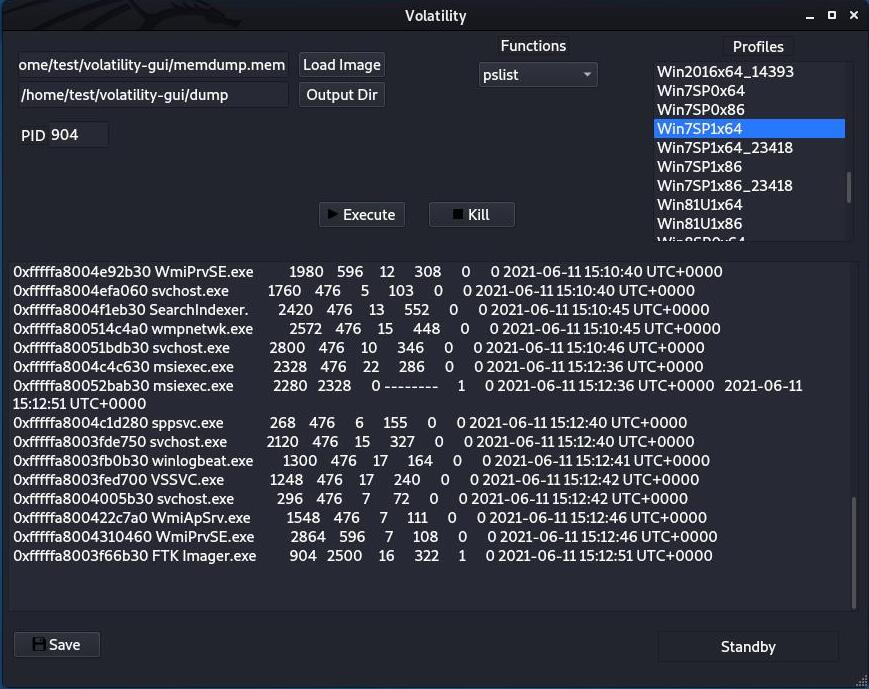

#Volatility GUI

This is a GUI for Volatility forensics tool written in PyQT5

###Prerequisites:
1- Installed version of Volatility.

2- Install PyQT5.

`sudo apt-get install python3-pyqt5`

3- Download Volatility GUI.

###Configuration
From the downloaded Volatility GUI, edit `config.py` file to specify 1- Python 2 bainary name or python 2 absolute path in `python_bin`.

2- Volatility binary absolute path in `volatility_bin_loc`.

Then run `config.py` script to build the profiles list according to your configurations
`python3 config.py`

After that start the gui by running `python3 vol_gui.py`.
